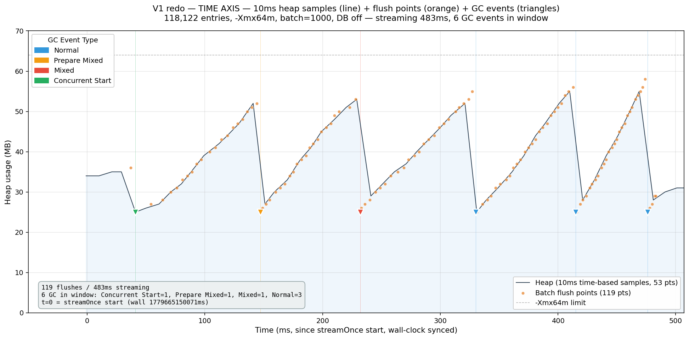
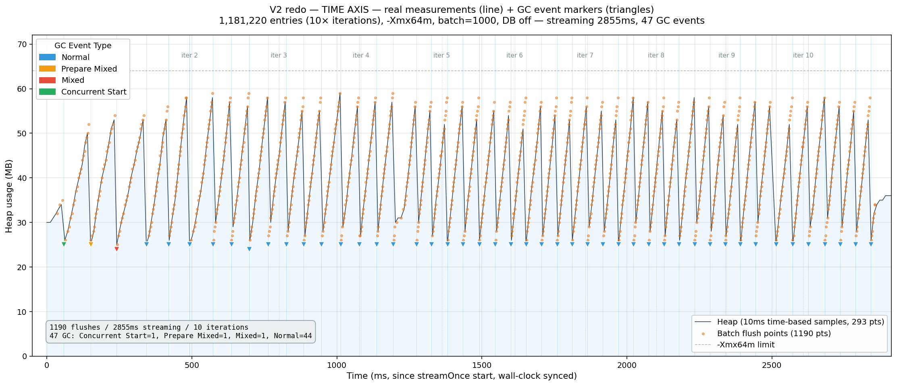
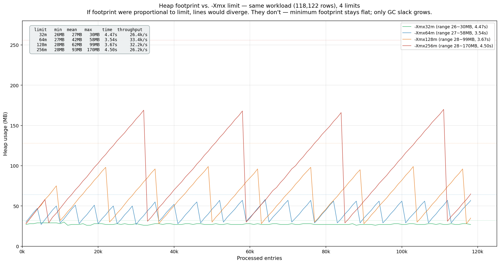
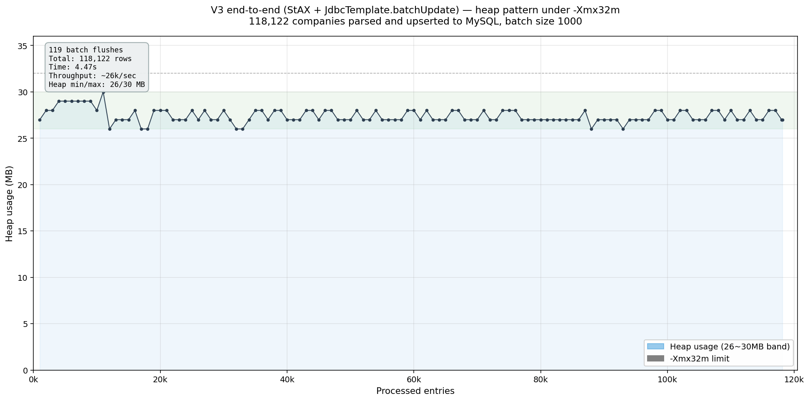
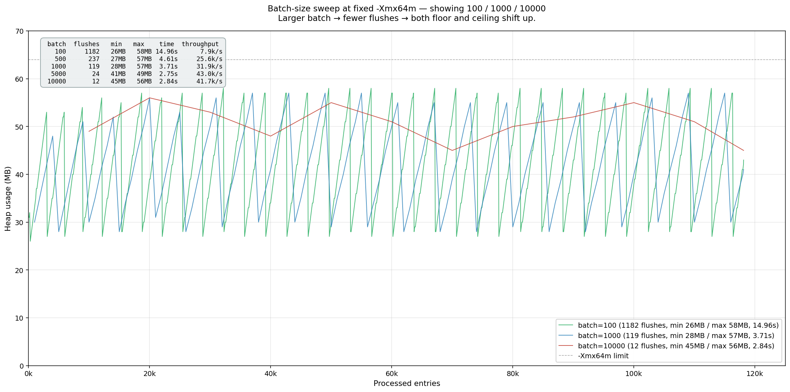
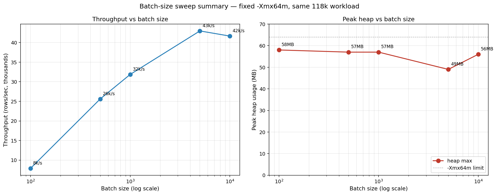
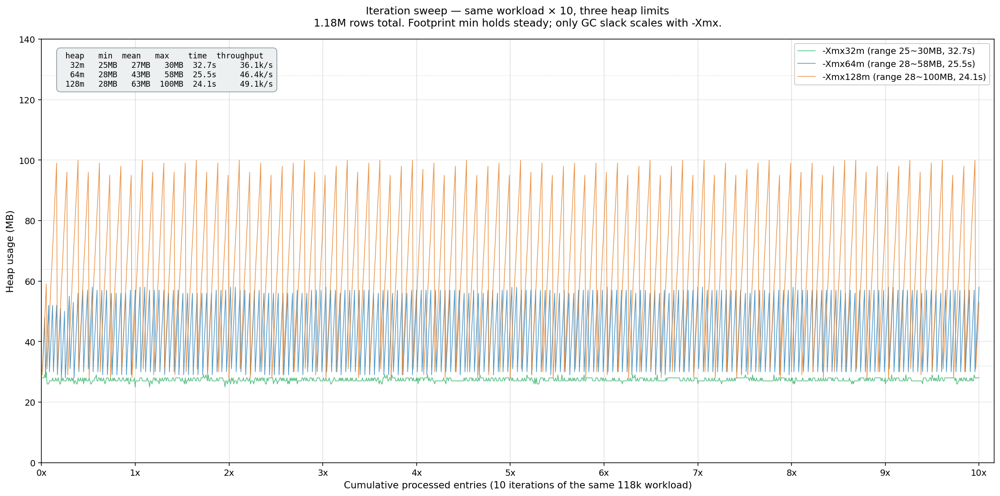
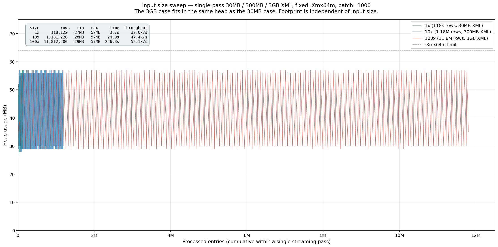
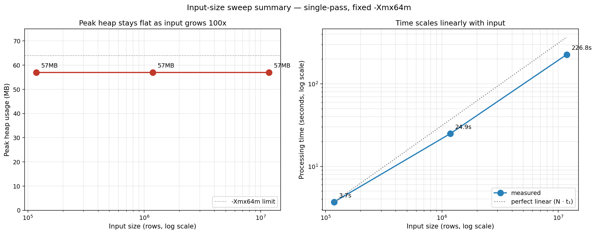
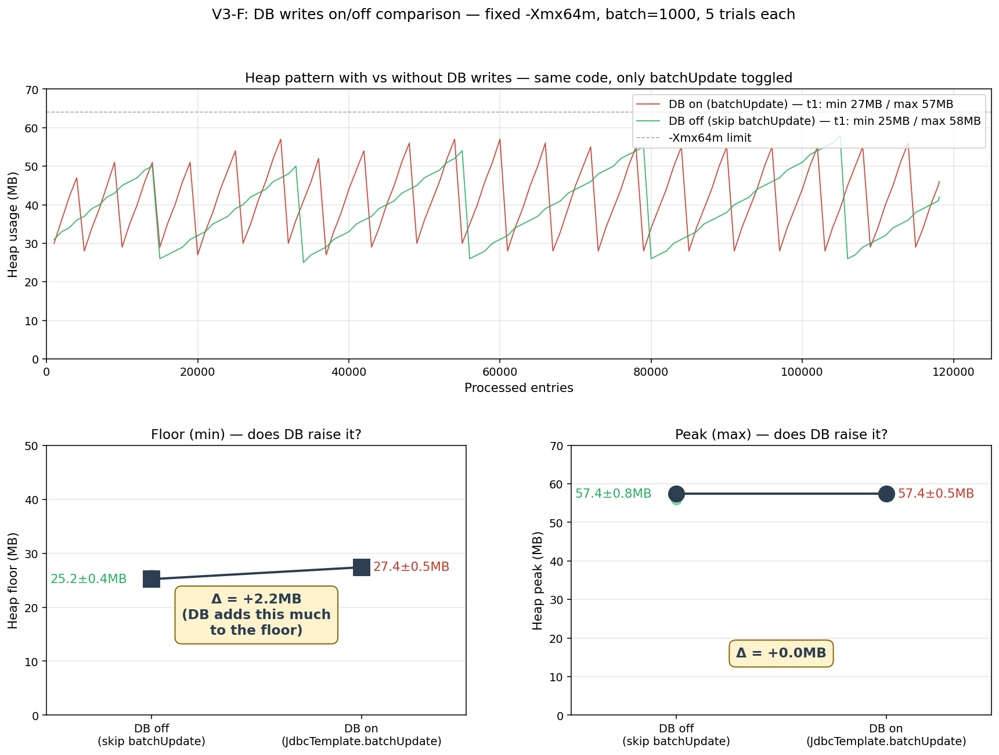

# 스트리밍 메모리 실험 일지

> 2026-05-02 ~ 2026-05-22.
> 30MB XML에서 시작해 3GB XML까지 — 정거장 모델이 어디까지 유지되는지 단계별로 본 기록.

이 문서는 결과보다 **왜 그 실험을 했는지**에 초점을 둔다. 차원별 요약 결과는 옆 [`README.md`](./README.md)에 있다.

---

## 0. 출발: 30MB XML이 들어왔다 (2026-05-02)

DART API의 `corpCode.xml`은 회사 등록부 전체 다운로드. zip 3.6MB → 풀면 XML 30MB. 매일 동기화해야 한다.

처음 떠올린 건 `DocumentBuilder.parse()`. 30MB 정도면 메모리에 통째로 올려도 되지 않나.

근데 머리에서 알람이 울렸다.

- DOM 객체 그래프 오버헤드 = 5~10배 → 150~300MB
- 매일 동기화면 매번 일어남
- 더 큰 데이터 (xlsx, parquet)가 나중에 들어오면? — 같은 아키텍처를 재사용 가능해야 한다

그래서 `StAX` 스트리밍을 떠올렸다. **창고가 아니라 정거장.** 데이터가 통과만 하고 쌓이지 않는다.

```
DOM:  [모든 데이터] → 메모리에 쌓임 (메모리 = 데이터 크기)
StAX: 데이터 → 정거장1 → 정거장2 → 출구 (메모리 = 정거장 크기 합)
```

가설: **footprint는 데이터 크기와 무관할 것.**

그런데 가설은 검증해야 한다.

---

## 1. V1 — "정말 일정한가?" (2026-05-02)

**의도:** 가장 빠듯한 조건에서도 작동하는지 본다. 한도가 빠듯하면 OOM이 가장 잘 드러난다.

**조건:** `-Xms32m -Xmx32m`, 117k 회사 1회 처리, batch 1000.

**결과 (텍스트):**
```
processed=5000   heap=26MB / 32MB
processed=10000  heap=24MB / 32MB
...
processed=110000 heap=24MB / 32MB
processed=115000 heap=19MB / 32MB
총 처리: 117,496
```

heap이 19~26MB로 카운트와 무관하게 등락. **32MB 안에서 117k 처리 완료.** 만약 DOM이었으면 OOM이었을 양.

이걸 더 자세히 보고 싶어서 `-Xmx64m + -Xlog:gc + 10ms 시간 기반 heap sampling`으로 한 번 더 돌렸다. 같은 워크로드, X축은 시간, GC 이벤트와 batch flush 시점을 분리해서 시각화 (2026-05-25 재측정).



해석:
- 회색 곡선 = 10ms마다 측정한 진짜 heap (53 sample)
- 주황 점 = batch flush 시점 (119개)
- 역삼각형 = GC 이벤트 (Young Normal / Prepare Mixed / Mixed / Concurrent Start)
- 톱니 모양 — 정거장 가득 → GC → 비움 → 다시 채움
- 첫 톱니 (0~40ms)가 다른 톱니보다 alloc 느림 → **JIT warm-up zone**. 24MB에서 천천히 35MB로 상승
- 그 후 톱니 모양이 일정. 한도까지 안 차고 25~55MB band에서 steady state

**한 번이 우연 아닐까?**

---

## 2. V2 — "10배 처리해도?" (2026-05-02)

**의도:** 한 번 작동했다고 끝이 아님. 누적 처리량을 늘려도 패턴이 유지되는지 본다. 처리량과 메모리가 분리됐다는 명제를 강화해야 한다.

**조건:** `-Xmx64m`, 같은 zip을 10번 반복 처리(누적 1.18M 행), batch 1000, `-Xlog:gc + 10ms heap sampling` (2026-05-25 재측정).



결과:
- 1.18M 행 처리 완료, 총 ~2.8초
- 47 GC 이벤트 (Normal 44, Mixed 1, Prepare Mixed 1, Concurrent Start 1)
- 10 iteration boundary 표시 (점선)
- 매 iteration 안에 톱니 3~4개씩 일정 패턴 반복

해석:
- 패턴 동일. **누적 처리량 10배여도 footprint는 64MB 한도 안에서 안정**
- 첫 iteration이 가장 큰 톱니 — JIT warm-up 영역
- 이후 톱니 모양이 거의 동일 → **정거장 모델이 누적 처리에서도 사이클 모양 유지**의 직접 증명
- **단, 여기까지는 "파싱 → 도메인 객체 만들고 버림"까지.** 운영에선 DB upsert가 끼어야 한다.

**그게 정거장 모델을 깨뜨릴 가능성?**

batch 1000건이 flush될 때까지 메모리에 머문다. PreparedStatement 캐시, JDBC driver buffer, 연결 풀이 패턴을 바꿀 수 있다. **검증 없이 운영 가져갈 수 없다.**

---

## 3. V3 시작 — "DB까지 합쳐서 검증해야 한다" (2026-05-21)

**의도:** 진짜 운영 흐름과 같은 조건에서 측정. 파싱 + 도메인 객체 + JDBC batch upsert 전부 한 파이프에.

**셋업 결정 — 두 개의 의문:**

**의문 1: Testcontainers를 써야 하나?**
처음엔 "회귀 테스트 도구 아닌가, 일회성 측정엔 무거운데"라고 생각했다. 그래서 로컬 MySQL 띄워서 측정 테이블만 만들고 drop하는 방향을 떠올렸다.

근데 `.withReuse(true)` 옵션이 있다는 걸 다시 확인. 첫 실행 후 컨테이너가 안 죽고 다음 실행 시 재사용. 첫 ~30초만 들이면 이후엔 즉시. 운영 datasource와 격리도 되고 깔끔.

`~/.testcontainers.properties`에 `testcontainers.reuse.enable=true` 한 줄 + `.withReuse(true)` 한 줄.

**의문 2: 어떻게 측정하나?**
flush 직후마다 `Runtime.totalMemory() - freeMemory()` 측정 → CSV에 기록. CSV는 그래프 만들 때 raw 데이터로. stdout 로그는 진행 확인용.

**셋업:**
- `MySQLContainer<>("mysql:8.0").withReuse(true)`
- `JdbcTemplate.batchUpdate` + `ON DUPLICATE KEY UPDATE`
- JDBC URL에 `?rewriteBatchedStatements=true` — 없으면 batch가 N번 INSERT로 풀려서 측정 무의미
- `EXPERIMENT_HEAP_LABEL` 환경변수로 출력 CSV 라벨 구분

코드: [`CorpCodeFetchSmokeTestV3.java`](../../../src/test/java/dev/gukin/einvestlab/company/CorpCodeFetchSmokeTestV3.java)

---

## 4. V3-A — "한도를 더 주면 어떻게 되지?" (2026-05-21)

**의도:** 정거장 모델이 정말 한도와 독립인지. 한도를 32m → 256m으로 8배 키워본다. 같은 footprint면 가설 확정, 한도 따라 자라면 가설 부정.

**조건:** heap 한도 ∈ {32m, 64m, 128m, 256m}, 118k 행, batch 1000.

| -Xmx | heap 범위 | 평균 | 시간 |
|---|---|---|---|
| 32m | **26~30MB** | 27.4 | 4.47s |
| 64m | 27~58MB | 42.0 | 3.54s |
| 128m | 28~99MB | 61.7 | 3.67s |
| 256m | 28~170MB | 93.0 | 4.50s |



**관찰:** 한도를 8배 키웠는데 **최저점은 26~28MB로 묶임**. 늘어나는 건 톱니 진폭(GC slack)일 뿐.

다른 말로:
- 실제 필요 메모리(정거장 크기) ≈ 28MB
- heap 한도는 GC가 게을러져도 되는 여유 공간만 결정
- "필요한 메모리"와 "한도"는 직교



32m 단독으로 보면 더 명백. 4.47s 내내 26~30MB의 좁은 밴드. 119번 batch flush가 모두 같은 범위.

**가설 확정:** footprint는 한도와 무관.

여기서 다음 의문이 자연스럽게 생겼다. "그러면 batch 사이즈는? 그게 진짜 정거장 크기 lever 아닌가?"

---

## 5. V3-C — "batch 1000은 합리적 선택이었나?" (2026-05-21)

**의도:** 정거장 크기를 결정하는 진짜 변수가 batch라면, batch를 sweep 하면 footprint가 비례할 것이다.

**조건:** `-Xmx64m` 고정, batch ∈ {100, 500, 1000, 5000, 10000}, 118k 행 1회. **각 케이스 5 trial 평균** (단발 측정의 5000이 outlier인지 확인하려고 후속 재측정).

| batch | flush 횟수 | heap 범위 (mean) | 시간 (mean) | 처리량 (mean) |
|---|---|---|---|---|
| 100 | 1182 | 25~58MB | 12.36s | 9.6k/s |
| 500 | 237 | 26~58MB | 4.60s | 25.7k/s |
| 1000 | 119 | 27~57MB | 3.72s | 31.9k/s |
| **5000** | **24** | **39~49MB** | **2.72s** | **43.5k/s** |
| 10000 | 12 | 46~57MB | 2.87s | 41.2k/s |

5 trial std ≤ 0.5MB / ≤ 0.3s. 안정 재현.





**관찰 1 — footprint 모양:** batch 커지면 **최저점 자체가 올라감** (27MB → 46MB). flush 사이에 더 많이 쌓이니까. **정거장 크기 = f(batch).** 가설 맞음.

**관찰 2 — throughput:** batch=100은 9.6k/s로 4.5배 느림. JDBC round trip 1182번이 대부분의 시간. batch=5000에서 43.5k/s 정점, 10000은 약간 떨어짐 — round trip 감소 효과 포화 + 큰 batch overhead.

**관찰 3 — sweet spot:** batch=5000이 throughput 최고면서도 64MB 안에서 가장 안전 (peak 49MB, band 10MB로 가장 좁음 — GC가 mixed mode로 자주 돌아 한도까지 안 올라감). 1000 대비 36% 빠름. spec의 batch=1000은 안전한 default지만 운영에선 5000 검토 가치.

**관찰 4 — 1000→5000 사이의 임계:** floor가 같은 5배 증가(100→500)에선 +1MB뿐인데 1000→5000에선 +12MB 점프. young gen 회수만 되던 영역(≤1000)에서 old gen으로 promote되는 영역(≥5000)으로 GC 모드 전환된 것으로 보임. 정확한 임계점(2000/3000/4000)은 측정 안 함 — 운영에 영향 작아서 보류.

---

## 6. V3-B — "V2를 DB 포함 흐름으로 재현" (2026-05-21)

**의도:** V2(같은 zip 10번 반복, DB 없음)는 "누적 입력과 footprint 무관"을 보였고, V3-A(단일 호출, DB 있음)는 "heap 한도와 footprint 무관"을 보였다. 둘이 만나는 영역 — **누적 호출 + DB 쓰기 + 다른 한도** — 에서도 둘 다 유지되는지 한 실험에 확인.

**조건:** 같은 zip 10회 반복(누적 1.18M 행), batch 1000, heap ∈ {32m, 64m, 128m}.

| -Xmx | heap 범위 | 평균 | 시간 | 처리량 |
|---|---|---|---|---|
| 32m | 25~30MB | 27.4 | 32.7s | 36.1k/s |
| 64m | 28~58MB | 43.2 | 25.5s | 46.4k/s |
| 128m | 28~100MB | 63.3 | 24.1s | 49.1k/s |



**관찰:** A에서 본 한도별 밴드가 누적 1.18M 처리에서도 그대로 유지. V2의 명제(누적 입력 크기와 footprint 분리)를 DB 포함 흐름에서 + 다른 한도들로 재확인.

여기까지 정리하면:

> **메모리 footprint ≈ (1 row당 메모리 단가) × batch 사이즈**
>
> - 누적 입력 크기와 무관
> - heap 한도와 무관
> - batch 사이즈에 비례

**근데 한 가지 좀 켕겼다.**

이 실험은 "같은 데이터를 10번 호출"이지 "한 번에 10배 큰 입력"이 아니다. 운영에서 진짜 큰 입력 하나가 들어왔을 때 — 예를 들어 다른 API가 1GB짜리 zip을 줬을 때 — 똑같이 작동한다는 보장이 아니다.

스트리밍 본질상 같을 거다. 하지만 **검증 안 한 가정**.

---

## 7. V3-D — "한 번에 100배 큰 입력도?" (2026-05-22)

**의도:** V3-B의 빈자리 메우기. 단일 입력 크기 자체를 키워본다. 합성 zip 생성기로 `<list>` 블록을 여러 배 복제한 큰 XML 만들기.

**규모 검토:**
- 1x = 30MB XML, 117k rows
- 10x = 300MB XML, 1.17M rows
- 100x = **3GB XML, 11.7M rows**
- 1000x = 30GB XML, 117M rows — 합성 12분 + 실행 50분 + 디스크 3.6GB. 비현실적.

1000x는 100x 결과 보고 의미 있으면 그때. 일단 100x까지.

**셋업:**
- `CorpCodeSyntheticZip` 유틸: 원본 zip의 inner XML 추출 → list 블록 N번 복제 → 새 zip
- corp_code 충돌은 `ON DUPLICATE KEY UPDATE`로 흡수 (메모리 측정에는 영향 없음 — N배만큼의 객체가 통과)

**조건:** `-Xmx64m`, batch 1000, 단일 streaming pass.

| 입력 | rows | zip 크기 | 풀린 XML | heap 범위 | 시간 | 처리량 |
|---|---|---|---|---|---|---|
| 1x | 118,122 | 3.6MB | 30MB | 27~57MB | 3.7s | 32.0k/s |
| 10x | 1,181,220 | 34.5MB | 300MB | 28~57MB | 24.9s | 47.4k/s |
| 100x | **11,812,200** | 345MB | **3GB** | **29~57MB** | 226.8s | **52.1k/s** |





**관찰:** **3GB XML이 30MB XML과 동일한 64MB 힙에 들어감.** Peak heap이 100배 입력에서도 57MB로 정확히 일정. 오른쪽 그래프의 점선은 ideal linear — 실제 시간이 그보다 살짝 빠른 건 JVM warm-up + JIT 효과.

**가장 깔끔한 증거.** 1000x로 더 갈 필요 없음 — 패턴이 명백.

---

## 8. V3-F — "DB 쓰기 자체가 정거장에 얼마를 더 추가하나?" (2026-05-23)

**의문:** V3-B 64m floor(28MB)와 V2 floor(~25MB) 사이에 미세한 차이가 있었지만 V2/V3는 측정 방법이 달라(GC 로그 정규식 vs CSV 직접 측정) 직접 비교가 깔끔하지 않았음. DB가 끼면서 PreparedStatement / JDBC driver buffer 같은 객체가 정거장에 추가 잔존할 텐데, **정량 측정 안 했음**.

**셋업:** V3 코드에 `EXPERIMENT_SKIP_DB` 환경변수 한 줄. `batchUpdate()` 호출만 분기. `batch.clear()`와 CSV 기록은 그대로 — 파싱 + 객체 만들고 버림은 동일. **DB 호출만 단변수.**

**조건:** -Xmx64m, batch=1000, input=1x, 각 조건 5 trial.

| | floor (min) mean±std | peak (max) mean±std | 시간 |
|---|---|---|---|
| DB off | 25.2±0.4MB | 57.4±0.8MB | 0.48s |
| DB on | 27.4±0.5MB | 57.4±0.5MB | 4.48s |
| **Δ** | **+2.2MB** | **+0.0MB** | **+4.00s** |



**핵심 발견:**

1. **Floor는 +2.2MB** — JDBC 인터널이 정거장에 들고 있는 메모리. PreparedStatement params buffer, MySQL driver의 packet buffer, JdbcTemplate 내부 객체 등이 batch flush 직후에도 잔존.
2. **Peak는 동일** — DB 호출이 garbage 생성 속도를 키우지는 않음. GC가 한도 근처에서 동일하게 작동.
3. **시간의 9/10이 DB 쓰기** — 0.48s → 4.48s. V3의 처리 시간 거의 전부가 JDBC가 차지.
4. **V2와 정확히 일치** — V2 minimum ~25MB ≈ dboff 25.2MB. 측정 방법 달라도 같은 값 → V2/V3 비교 신뢰성 확인.

**한 줄 정리:**
> 정거장 모델은 깨지지 않는다. 다만 정거장에 **JDBC 인터널 ~2MB 상수**가 추가될 뿐.

---

## 종합

V1/V2에서 시작한 "정거장 모델" 가설을 4개 축에서 검증:

| 차원 | 변동 | footprint 영향 |
|---|---|---|
| heap 한도 | 32m → 256m (8x) | ❌ 없음 (GC slack만 키움) |
| 누적 입력 크기 | 1x → 10x (같은 데이터 10번 반복) | ❌ 없음 |
| **단일 입력 크기** | 30MB → 3GB (100x) | ❌ 없음 |
| batch 사이즈 | 100 → 10000 (100x) | ✅ 비례 (27MB → 46MB) |
| **DB 호출** | off → on | ✅ floor +2.2MB 상수 (JDBC 인터널) |

> **메모리 footprint ≈ (1 row당 메모리 단가) × batch 사이즈 + JDBC 인터널(~2MB)**

1 row당 메모리 단가는 도메인 객체(`CompanyRow`) 발자국으로 V3-C에서 대략 0.0025MB/row로 측정됨. JDBC 인터널 비용은 V3-F에서 약 2.2MB로 측정됨. **batch 사이즈만이 진짜 lever, DB는 상수.**

## 회고

이 일지가 보여주는 사고 흐름:

1. **가설 — DOM이 부담스럽다 → 정거장 모델로 해결될 것**
2. **빠듯한 조건에서 검증 (V1: 32m)** — 우선 작동만 확인
3. **누적해서 검증 (V2: 1.17M)** — 한 번이 우연 아닌지
4. **켕기는 점 인지 (DB가 빠졌다)** — 가설을 좁힘
5. **셋업 의문 풀기 (Testcontainers reuse)** — 도구 선택 비용 따짐
6. **DB 포함 1차 측정 (V3-A: 한도 sweep)** — 가설 직접 검증
7. **다음 의문 (그럼 batch는?) — V3-C** — 진짜 lever 찾기
8. **누적 재검증 (V3-B)** — V2 결과를 새 흐름으로
9. **또 켕기는 점 (단일 입력 크기는 못 봤다) — V3-D** — 마지막 빈자리
10. **또또 켕기는 점 (DB가 정거장에 얼마 추가했는지?) — V3-F** — 단변수 분리 측정

각 단계가 다음 단계의 의문을 만들고, 그 의문이 다음 실험의 의도가 됐다. **결과를 미리 알고 가설을 보강한 게 아니라, 매번 켕기는 곳을 좁혀가는 과정.**

운영 후속 결정:
- spec의 batch=1000은 안전한 default이지만 **운영 적용 시 batch=5000 검토 가치** (throughput 35% 향상, 64MB 안에서 안전)
- 모니터링: 5000건 단위 heap 로그 — minimum이 28~50MB 범위 벗어나면 회귀 신호
