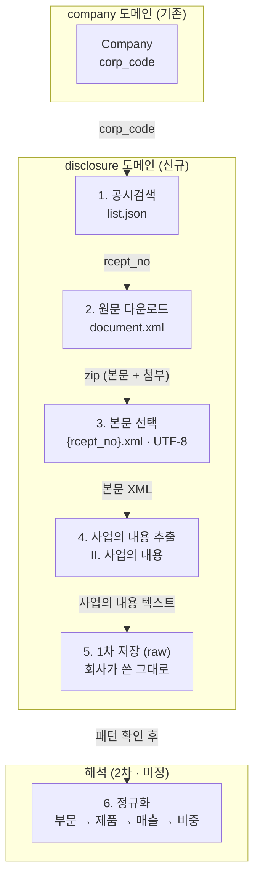
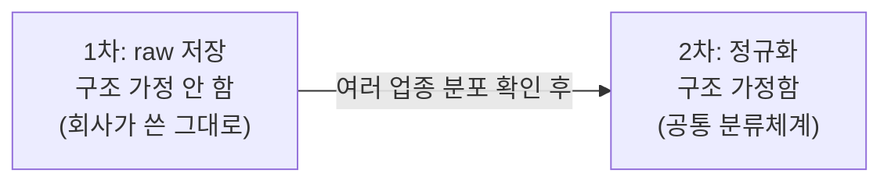

# 사업의 내용 수집 플로우 (작업 초안)

> 상태: spike 단계. 1~4단계는 실물로 검증 완료, 5단계(1차 raw 저장)는 granularity A 확정(8개 섹터 조사 근거), 6단계(2차 정규화)는 LLM 추출 방향 + Offering/Concept 2층 모델 확정.
>
> 목표: 각 회사가 **무엇을 제공하는지**(+ 매출 비중)를 구조화해 **돈의 흐름을 사전 감지**. 사업보고서의 "II. 사업의 내용"이 원천.
>
> 핵심 쿼리: **역방향** — "이 제품/서비스를 제공하는 회사는 어디인가?" (Concept → Companies). 정방향(회사 → 제공물)은 부산물로 따라온다.

## 전체 파이프라인



## 단계별 데이터·상태

| 단계 | 입력 | 처리 | 출력 | 상태 |
|---|---|---|---|---|
| 1 공시검색 | `corp_code` | `list.json` (`A001`, `last_reprt_at=Y`, 2년 범위, 최신 1건) | `rcept_no` (`BusinessReportRef`) | 코드 + 라이브 검증 |
| 2 원문 다운로드 | `rcept_no` | `document.xml` | zip (본문 1 + 첨부 N) | 코드 + 단위 테스트 |
| 3 본문 선택 | zip | 이름이 정확히 `{rcept_no}.xml` 인 엔트리, UTF-8 | 본문 XML | 코드 + 단위 테스트 |
| 4 사업의 내용 추출 | 본문 XML | `II. 사업의 내용` 섹션 슬라이스 | 텍스트 (+표) | 코드 + 단위 테스트 |
| 5 1차 저장 (raw) | 텍스트 | 회사가 쓴 그대로 보관 | DB (`business_contents`) | 코드 + 단위 테스트 |
| 6 2차 정규화 | raw | 부문/제품/매출/비중 추출 (LLM?) | 정규 스키마 | 미정 |

### 확인된 사실 (삼성전자 2025 사업보고서, rcept_no 20260310002820)

- 원문은 **UTF-8** (EUC-KR 아님). 변환 불필요.
- zip 안 = 본문 `{rcept_no}.xml`(8.3MB) + 첨부 `{rcept_no}_NNNNN.xml`(감사보고서·연결감사보고서). **사업의 내용은 본문에만.**
- "사업의 내용"은 `II.` 아래 7개 하위: 사업의 개요 / 주요 제품 및 서비스 / 원재료 및 생산설비 / 매출 및 수주상황 / 위험관리 및 파생거래 / 주요계약 및 연구개발활동 / 기타 참고사항.

## 1차 / 2차 경계



원칙: **수집 시점엔 정규화하지 않는다.** "분류"는 곧 해석이고, 해석은 패턴 확정을 요구한다. 수집(raw)은 구조를 가정하지 않으므로 패턴 확정을 기다릴 필요가 없다 — **수집 자체가 패턴 스터디**다.

### 1차 raw granularity (A 확정)

| 안 | 저장 형태 | 패턴 의존 |
|---|---|---|
| A | "사업의 내용" 섹션 텍스트 통째 | 없음 (모든 회사 가능) |
| B | "주요 제품/서비스" 표 영역만 텍스트 | 거의 없음 |
| C | 추출된 행 `(부문, 제품, 매출, 비중)` | 있음 (그 표 존재 가정) |

**A로 확정** (아래 8개 섹터 조사: 제품·매출·비중 표가 4/8만 존재 → C는 절반에서 깨짐). raw 섹션 텍스트만이 모든 서식을 담는다. C(행 추출)는 2차에서 회사별로 수행.

### 2차 목표 모델: Offering / Concept 2층 (확정)

역방향 쿼리가 되려면 회사마다 다르게 쓴 이름("스마트폰용 OLED 패널" vs "중소형 OLED")을 하나의 개념으로 묶는 층이 필요하다. 원문 텍스트 검색만으로는 못 묶는다.

```
Offering  회사가 쓴 그대로: 회사, 부문, 제품/서비스명 raw, 매출, 비중, 원문 위치
Concept   공통화된 개념: "OLED 패널", "DRAM", "간편식" …
Offering ↔ Concept  다대다 매핑 (하나의 Offering이 여러 개념에 걸릴 수 있음)
```

- **Offering**은 회사의 주장을 보존하는 층, **Concept**은 검색을 위한 층. 역할이 다르므로 분리한다.
- 이 분리 덕분에 Concept 체계를 갈아엎어도 Offering은 안 건드린다 — raw 원칙(수집 시점엔 해석하지 않는다)이 2차 안에서 한 번 더 반복되는 구조.
- **Concept 사전은 상향식**: 기존 산업분류(한국표준산업분류, GICS 등)는 회사 단위 업종이라 제품 granularity가 안 맞고, 임베딩만 쓰면 묶인 이유 설명·카테고리 브라우징이 안 된다. 실제 Offering 이름 분포가 수십 개 회사 분량 쌓인 뒤 사전을 만든다 (지금 만들면 삼성 사례 과적합). 임베딩은 매핑 후보 추천 보조로만.
- **계층은 지연**: Concept을 평평하게 쌓다가 검색에서 계층이 필요해지면 Concept 간 부모 관계 하나 추가.
- 2차 순서: **2a Offering 추출** (LLM, 공통화 없이 raw 이름 그대로 — 이것만으로 원문 검색 가능) → **2b Concept 공통화** (축적 후 시작). 카테고리는 설계하는 게 아니라 2차·3차 집계 처리로 만들어진다.

### 삼성 사례 기준 Offering 형태 가설

```
Company
  └ Segment (DX, DS, SDC, Harman)     ← 부문
      ├ products[]  (DRAM, NAND, OLED…)  ← 무엇을 제공
      ├ revenue                          ← 돈 규모
      └ share %                          ← 비중 (흐름 신호)
```

삼성 주요 제품 매출표 (1차에 raw로 들어올 실제 데이터 예시):

| 부문 | 주요 제품 | 매출액(억) | 비중 |
|---|---|---|---|
| DX | TV, 모니터, 냉장고, 세탁기, 에어컨, 스마트폰, 네트워크, PC | 1,879,673 | 56.3% |
| DS | DRAM, NAND Flash, 모바일AP | 1,301,282 | 39.0% |
| SDC | 스마트폰용 OLED 패널 | 298,417 | 8.9% |
| Harman | 디지털 콕핏, 카오디오, 포터블 스피커 | 157,833 | 4.7% |

## 다업종 조사 결과 (8개 섹터 · 2025 사업보고서)

| 섹터 | 회사 | corp_code | 사업의 내용 | 하위 | 템플릿 | 제품·매출·비중 표 |
|---|---|---|---|---|---|---|
| 반도체/하드웨어 | 삼성전자 | 00126380 | 37,781자 | 7 | 일반 | 있음 |
| 인터넷 플랫폼 | NAVER | 00266961 | 44,284자 | 7 | 일반 | 없음 |
| 건설/EPC | 현대건설 | 00164478 | 59,991자 | 7 | 일반 | 없음 |
| 전력/유틸리티 | 한국전력공사 | 00159193 | 156,873자 | 7 | 일반 | 있음 |
| 금융/인터넷은행 | 카카오뱅크 | 01133217 | 28,557자 | 5 | 금융 | 없음 |
| 식품/바이오소재 | CJ제일제당 | 00635134 | 34,237자 | 7 | 일반 | 있음 |
| 바이오/제약 | 셀트리온제약 | 00541349 | 19,194자 | 7 | 일반 | 없음 |
| 로봇/중소제조 | 에브리봇 | 01201590 | 30,730자 | 7 | 일반 | 있음 |

1. **경계 검출 8/8 성공** (금융 포함) → stage 1의 유일한 가정(`II. 사업의 내용` 경계)이 업종 불문 안정.
2. **템플릿 2종**: 7곳 표준 7항목 / 카카오뱅크만 금융 서식 5항목(개요·영업의 현황·파생상품·영업설비·재무건전성). 보험·증권 미확인.
3. **제품·매출·비중 표 4/8만 존재** → 표 의존 추출은 절반에서 깨짐. (탐지기가 `비중`+`매출` 키워드 기반이라 라벨 다른 표는 놓쳤을 수 있으나 방향은 "보편 아님".)
4. 크기 19K~157K자, 편차 큼.

## 열린 결정

- **1차 granularity**: A 확정 (raw 섹션 텍스트). 근거: 제품·매출·비중 표 4/8.
- **2차 추출 방식**: LLM 유력 (템플릿 ≥2종 + 표 선택적 → 규칙 기반은 서식별 분기 폭발). 참고 ADR `disclosure-classifier`, `llm-client`.
- **2차 정규화 스키마**: Offering/Concept 2층으로 확정 (위 섹션). 남은 것: 금융 서식 처리 — "제품" 개념 자체가 다름(영업수익 구조), 2b에서 실물 보고 결정.
- **저장 대상 범위**: "주요 제품/서비스"만 vs 사업의 내용 전체 (금융은 해당 항목 없음 → 전체 저장이 안전).
- **연도 축적**: 최신 1건만 vs 연도별 시계열 (비중 변화 = 흐름 신호라 시계열 가치 있음).

## 다음 행동

stage 1 빌드 완료 (1~5단계 + 조립). 수집 경로: `POST /internal/business-contents/{corpCode}/collect` → `BusinessContentCollectUseCase.collect(corpCode, baseTime)` → 공시검색 → 원문 → 본문 선택 → 섹션 추출 → `business_contents` 저장. 접수번호 unique 로 재수집 방지(멱등), 회사당 연도별 1건이라 시계열 축적 가능.

남은 것:

1. **라이브 검증**: 삼성전자·카카오뱅크 완료 (2026-07-19). 멱등(`ALREADY_COLLECTED`) 확인. raw 길이는 태그 포함이라 탐침의 텍스트 기준 관측치보다 큼 (삼성 145,693자 / 카카오뱅크 191,356자).
   - **경계 버그 발견·수정**: 평문 문자열 매칭은 카카오뱅크처럼 앞 장에 북마크 참조 속성(`ID="II. 사업의 내용"` 류)이 있는 문서에서 참조 지점부터 잘라 I장 약 8만 자가 오염됨. 경계를 제목 요소(`<TITLE ...>II. 사업의 내용` / `<TITLE ...>III.`)에 앵커해 해결, 북마크 회귀 테스트 추가. 두 회사 모두 제목 요소 시작·하위 항목 전체 포함(일반 7항목·금융 5항목)·다음 섹션 미포함 확인.
   - **8개 섹터 전수 완료 (2026-07-19)**: 탐침했던 8개 회사 모두 수집 성공. 전 행이 `<TITLE ` 시작 + 북마크 잔재 0 + 사업의 개요가 600자 내 등장. raw 길이 130K(셀트리온제약)~943K자(한국전력 — 표 비중이 커 텍스트 대비 약 6배).
2. **오염 방지 가드 완료 (2026-07-19)**: 추출기가 저장 전 불변식 검사 — 하위 항목 제목 존재, 길이 밴드(1천~500만 자). 위반 시 예외라 조용한 오염이 시끄러운 실패로 바뀜. 실물 경계 슬라이스(삼성·카카오뱅크, 북마크 참조 재현 포함)를 픽스처 회귀 테스트로 고정 — 버그 패턴으로 되돌려 빨간불 확인(known-violation 검증) 후 원복.
3. **전 회사 순회 트리거**: 스케줄러가 Company 목록을 돌며 수집 (company 도메인의 회사 목록 조회 포트 필요). 이때 예외 세분화(`SourceUnavailable` vs `ContractViolation`)와 부분 실패 집계를 함께 도입.
4. **stage 2a 준비**: raw 가 수십 개 회사 분량 쌓이면 Offering 추출(LLM) 설계 시작.
