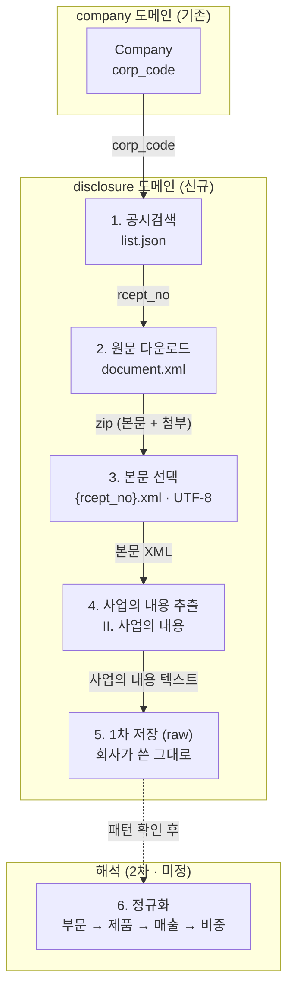
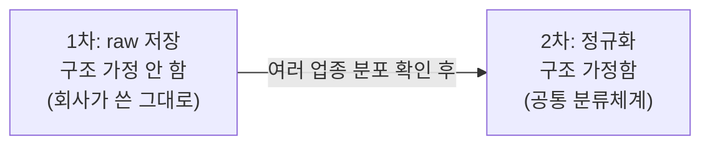

# 사업의 내용 수집 플로우 (작업 초안)

> 상태: spike 단계. 1~4단계는 실물로 검증 완료, 5단계(1차 raw 저장)는 granularity A 확정(8개 섹터 조사 근거), 6단계(2차 정규화)는 LLM 추출 방향 + Offering/Concept 2층 모델 확정.
>
> 목표: 각 회사가 **무엇을 제공하는지**(+ 매출 비중)를 구조화해 **돈의 흐름을 사전 감지**. 사업보고서의 "II. 사업의 내용"이 원천.
>
> 핵심 쿼리: **역방향** — "이 제품/서비스를 제공하는 회사는 어디인가?" (Concept → Companies). 정방향(회사 → 제공물)은 부산물로 따라온다.

## 전체 파이프라인



## 단계별 데이터·상태

| 단계 | 입력 | 처리 | 출력 | 상태 |
|---|---|---|---|---|
| 1 공시검색 | `corp_code` | `list.json` (`A001`, 2년 범위, 최신순 목록 — 원본·정정본 포함) | `rcept_no` 목록 (`BusinessReportFiling`) | 코드 + 라이브 검증 |
| 2 원문 다운로드 | `rcept_no` | `document.xml` | zip (본문 1 + 첨부 N) | 코드 + 단위 테스트 |
| 3 본문 선택 | zip | 이름이 정확히 `{rcept_no}.xml` 인 엔트리, UTF-8 | 본문 XML | 코드 + 단위 테스트 |
| 4 사업의 내용 추출 | 본문 XML | `II. 사업의 내용` 섹션 슬라이스 | 텍스트 (+표) | 코드 + 단위 테스트 |
| 5 1차 저장 (raw) | 텍스트 | 회사가 쓴 그대로 보관 | DB (`business_contents`) | 코드 + 단위 테스트 |
| 6 2차 정규화 | raw | 부문/제품/매출/비중 추출 (LLM?) | 정규 스키마 | 미정 |

### 확인된 사실 (삼성전자 2025 사업보고서, rcept_no 20260310002820)

- 원문은 **UTF-8** (EUC-KR 아님). 변환 불필요.
- zip 안 = 본문 `{rcept_no}.xml`(8.3MB) + 첨부 `{rcept_no}_NNNNN.xml`(감사보고서·연결감사보고서). **사업의 내용은 본문에만.**
- "사업의 내용"은 `II.` 아래 7개 하위: 사업의 개요 / 주요 제품 및 서비스 / 원재료 및 생산설비 / 매출 및 수주상황 / 위험관리 및 파생거래 / 주요계약 및 연구개발활동 / 기타 참고사항.

## 1차 / 2차 경계



원칙: **수집 시점엔 정규화하지 않는다.** "분류"는 곧 해석이고, 해석은 패턴 확정을 요구한다. 수집(raw)은 구조를 가정하지 않으므로 패턴 확정을 기다릴 필요가 없다 — **수집 자체가 패턴 스터디**다.

### 1차 raw granularity (A 확정)

| 안 | 저장 형태 | 패턴 의존 |
|---|---|---|
| A | "사업의 내용" 섹션 텍스트 통째 | 없음 (모든 회사 가능) |
| B | "주요 제품/서비스" 표 영역만 텍스트 | 거의 없음 |
| C | 추출된 행 `(부문, 제품, 매출, 비중)` | 있음 (그 표 존재 가정) |

**A로 확정** (아래 8개 섹터 조사: 제품·매출·비중 표가 4/8만 존재 → C는 절반에서 깨짐). raw 섹션 텍스트만이 모든 서식을 담는다. C(행 추출)는 2차에서 회사별로 수행.

### 2차 목표 모델: Offering / Concept 2층 (확정)

역방향 쿼리가 되려면 회사마다 다르게 쓴 이름("스마트폰용 OLED 패널" vs "중소형 OLED")을 하나의 개념으로 묶는 층이 필요하다. 원문 텍스트 검색만으로는 못 묶는다.

```
Offering  회사가 쓴 그대로: 회사, 부문, 제품/서비스명 raw, 매출, 비중, 원문 위치
Concept   공통화된 개념: "OLED 패널", "DRAM", "간편식" …
Offering ↔ Concept  다대다 매핑 (하나의 Offering이 여러 개념에 걸릴 수 있음)
```

- **Offering**은 회사의 주장을 보존하는 층, **Concept**은 검색을 위한 층. 역할이 다르므로 분리한다.
- 이 분리 덕분에 Concept 체계를 갈아엎어도 Offering은 안 건드린다 — raw 원칙(수집 시점엔 해석하지 않는다)이 2차 안에서 한 번 더 반복되는 구조.
- **Concept 사전은 상향식**: 기존 산업분류(한국표준산업분류, GICS 등)는 회사 단위 업종이라 제품 granularity가 안 맞고, 임베딩만 쓰면 묶인 이유 설명·카테고리 브라우징이 안 된다. 실제 Offering 이름 분포가 수십 개 회사 분량 쌓인 뒤 사전을 만든다 (지금 만들면 삼성 사례 과적합). 임베딩은 매핑 후보 추천 보조로만.
- **계층은 지연**: Concept을 평평하게 쌓다가 검색에서 계층이 필요해지면 Concept 간 부모 관계 하나 추가.
- 2차 순서: **2a Offering 추출** (LLM, 공통화 없이 raw 이름 그대로 — 이것만으로 원문 검색 가능) → **2b Concept 공통화** (축적 후 시작). 카테고리는 설계하는 게 아니라 2차·3차 집계 처리로 만들어진다.

### 삼성 사례 기준 Offering 형태 가설

```
Company
  └ Segment (DX, DS, SDC, Harman)     ← 부문
      ├ products[]  (DRAM, NAND, OLED…)  ← 무엇을 제공
      ├ revenue                          ← 돈 규모
      └ share %                          ← 비중 (흐름 신호)
```

삼성 주요 제품 매출표 (1차에 raw로 들어올 실제 데이터 예시):

| 부문 | 주요 제품 | 매출액(억) | 비중 |
|---|---|---|---|
| DX | TV, 모니터, 냉장고, 세탁기, 에어컨, 스마트폰, 네트워크, PC | 1,879,673 | 56.3% |
| DS | DRAM, NAND Flash, 모바일AP | 1,301,282 | 39.0% |
| SDC | 스마트폰용 OLED 패널 | 298,417 | 8.9% |
| Harman | 디지털 콕핏, 카오디오, 포터블 스피커 | 157,833 | 4.7% |

## 다업종 조사 결과 (8개 섹터 · 2025 사업보고서)

| 섹터 | 회사 | corp_code | 사업의 내용 | 하위 | 템플릿 | 제품·매출·비중 표 |
|---|---|---|---|---|---|---|
| 반도체/하드웨어 | 삼성전자 | 00126380 | 37,781자 | 7 | 일반 | 있음 |
| 인터넷 플랫폼 | NAVER | 00266961 | 44,284자 | 7 | 일반 | 없음 |
| 건설/EPC | 현대건설 | 00164478 | 59,991자 | 7 | 일반 | 없음 |
| 전력/유틸리티 | 한국전력공사 | 00159193 | 156,873자 | 7 | 일반 | 있음 |
| 금융/인터넷은행 | 카카오뱅크 | 01133217 | 28,557자 | 5 | 금융 | 없음 |
| 식품/바이오소재 | CJ제일제당 | 00635134 | 34,237자 | 7 | 일반 | 있음 |
| 바이오/제약 | 셀트리온제약 | 00541349 | 19,194자 | 7 | 일반 | 없음 |
| 로봇/중소제조 | 에브리봇 | 01201590 | 30,730자 | 7 | 일반 | 있음 |

1. **경계 검출 8/8 성공** (금융 포함) → stage 1의 유일한 가정(`II. 사업의 내용` 경계)이 업종 불문 안정.
2. **템플릿 2종**: 7곳 표준 7항목 / 카카오뱅크만 금융 서식 5항목(개요·영업의 현황·파생상품·영업설비·재무건전성). 보험·증권 미확인.
3. **제품·매출·비중 표 4/8만 존재** → 표 의존 추출은 절반에서 깨짐. (탐지기가 `비중`+`매출` 키워드 기반이라 라벨 다른 표는 놓쳤을 수 있으나 방향은 "보편 아님".)
4. 크기 19K~157K자, 편차 큼.

## stage 2a 탐침 결과 (2026-07-21 · 46개사)

심층 8개사(삼성전자·카카오뱅크·현대건설·하이브·강원랜드·삼성생명·미래에셋증권·BGF리테일) + 46개 전체 구조 스캔.

### 서식 분포

| 서식 | 수 | 구조 |
|---|---|---|
| 일반 | 39 | 7항목. 비중표 38/39 (BGF리테일만 없음 — 단일 사업이라 쪼갤 게 없음) |
| 순수 금융 | 5 | 5항목, 업권(은행·보험·증권·지주) 불문 목차 동일 |
| 혼합 | 2 | 카카오·현대자동차 — `(제조서비스업)` 7항목 + `(금융업)` 5항목, 번호 재시작 |

### 핵심 관찰

1. **회사마다 매출을 쪼개는 축이 다르다**: 부문(삼성), 품목(하이브), 법인×사업(강원랜드), 부문×지역(현대건설), 사업부문(증권 WM/IB/S&T/PI). 공통 구조는 "매출 단위 하나에 제공물 이름 여러 개".
2. **금융 제외 불필요**: 제공물 이름은 금융에서 오히려 풍부(카카오뱅크 상품군, 삼성카드 취급업무 표). 매출·비중도 은행만 없고, 보험은 상품별 수입보험료+비중이 산문에(생존 14.4%·사망 50.9%·퇴직연금 31.8%), 증권은 부문별 영업수익 표가 있음. 단, **수치의 기준이 다르다** — 매출액 / 수입보험료 / 영업수익 / 취급고 → `revenue_basis` 필드로 흡수.
3. **시계열 공짜**: 매출표가 전부 3개년(당기·전기·전전기) 포함 → 보고서 1건에서 비중 변화 신호 추출 가능.
4. **입력 크기 문제없음**: 태그 제거(TR→줄바꿈, TD→구분자) + 하위 항목 선별(1·2·4번 / 금융은 1번+2번 산문부) 후 회사당 6K~21K자.

### Offering 스키마 초안

추출 목표는 세 질문: **뭘 팔아? 얼마나 팔려? 누구에게 팔아?(선택)**

추출 제1원칙: **보고서가 명시한 것만 뽑는다. 회사가 정의하지 않은 건 추측해 만들지 않는다 — 없으면 null/빈 값.** (해석·공통화는 2b Concept 층의 일. 이 원칙 덕에 추출값이 원문에 문자열로 존재하는지 기계 검증 가능.)

**행 의미론: Offering 행 하나 = 보고서가 명시한 사실 하나.** segment는 유니크 키가 아니다 — 같은 segment 행이 연도별·사실 분리(상품 나열 vs 규모 수치)·회사 명시 하위 구분(국내/해외)으로 여러 개일 수 있다. 회사가 묶어준 것만 한 행에 묶고, 안 묶은 건 합치지 않는다. 유일성 DB 제약은 두지 않는다 (서식 변형이 제약을 수집 실패로 만든다).

```
Offering
  corp_code
  business_part   제조서비스업 | 금융업 (혼합 서식 파트 구분, 단일 서식은 단일값)
  segment         회사가 구분 축으로 세운 라벨 (DX, 토목, 음반/음원…) — 축 없이 나열이면 null
  qualifier       회사가 행에 붙인 추가 구분 라벨 그대로 (국내 | 해외 | 제·상품 …) — 없으면 null
  products[]      제공물 이름들 (TV, DRAM, 신용대출…) ← "뭘 팔아". 검색·Concept 매핑 대상
  revenue         명시 금액 + 명시 단위 (환산은 코드가, LLM 은 명시값만)
  revenue_basis   매출액 | 수입보험료 | 영업수익 | 취급고 | 수신 잔액 | 수주총액 … — 회사가 쓴 기준 그대로
  revenue_share   비중 % ← "얼마나". 명시 없으면 null (은행·단일사업·과거 연도)
  customers[]     그 행에 명시된 상대 ← "누구에게"(선택). 주요 매출처·수주 발주처 등
  entity          그 사실의 주체로 본문이 명시한 법인 (삼성카드, 태국법인…) — 문서 회사 자신이면 null
  fiscal_year     기수/연도 (3개년 행 분리)
  source_filing   접수번호 (근거 추적)
```

### LLM 추출 실측 (2026-07-25 · gpt-5-mini · zero-shot 규칙만)

삼성전자 33행·삼성생명 22행 추출. 환각 없음(스팟 체크 전 수치 원문 실재), 연도 분리·당기만 비중·수주 행(Tesla)·조원/억원/백만RMB 단위 보존 전부 정확. 비용 2건 합계 ≈ $0.035.

발견 → 설계 입력:
1. **합계 행 미필터** (규칙 8 위반, 삼성 총계 3행 포함 + 주요 매출처를 합계 행에 부착) → few-shot 예시 필요 + 가드에 구조 검증(합계류 키워드·비중 합) 추가. 문자열 대조만으로는 합계 포함을 못 잡음(합계도 원문에 실재).
2. **basis 어휘 표류** (매출액/매출/매출실적 혼재) → 후처리 정규화 또는 프롬프트에 어휘 고정.
3. **가드의 수치 대조는 정규화 필요** — "3조 8,542억원" ↔ 38542(억원)처럼 한국어 수 표기는 단순 문자열 대조가 깨짐.
4. **entity 필드 추가** — 종속회사 서술(삼성카드 취급고, 태국법인 수입보험료)이 정확히 추출되는데 귀속 주체를 담을 자리가 없었음. 본문이 명시한 주체만 기록(추측 금지 원칙 유지), 문서 회사면 null.

### 슬라이서 요구사항 (탐침으로 확정)

- 일반: 하위 1·2·4번. 금융: 1번 + 2번(영업의 현황)의 산문 앞부분 — 뒤쪽 조달·운용 표는 노이즈.
- 혼합 서식: `(제조서비스업)`/`(금융업)` 접두사로 파트를 나눠 각각 슬라이스 (번호 재시작 주의).
- 표 변환: TR→줄바꿈, TD→구분자 유지 — 행 구조가 매출·비중의 원천.

### 남은 리스크

- 금융지주(KB·신한) 심층 미확인 — 자회사별 서술 구조 추정, 추출 실험에서 검증.
- 단위·연결/별도 기준 정규화, 증권 영업수익의 총액성(트레이딩 총수익이라 비중 왜곡) 처리.

## 열린 결정

- **1차 granularity**: A 확정 (raw 섹션 텍스트). 근거: 제품·매출·비중 표 4/8.
- **2차 추출 방식**: LLM 유력 (템플릿 ≥2종 + 표 선택적 → 규칙 기반은 서식별 분기 폭발). 참고 ADR `disclosure-classifier`, `llm-client`.
- **2차 정규화 스키마**: Offering/Concept 2층으로 확정 (위 섹션). 남은 것: 금융 서식 처리 — "제품" 개념 자체가 다름(영업수익 구조), 2b에서 실물 보고 결정.
- **저장 대상 범위**: "주요 제품/서비스"만 vs 사업의 내용 전체 (금융은 해당 항목 없음 → 전체 저장이 안전).
- **연도 축적**: 최신 1건만 vs 연도별 시계열 (비중 변화 = 흐름 신호라 시계열 가치 있음).

## 다음 행동

stage 1 빌드 완료 (1~5단계 + 조립). 수집 경로: `POST /internal/business-contents/{corpCode}/collect` → `BusinessContentCollectUseCase.collect(corpCode, baseTime)` → 공시검색 → 원문 → 본문 선택 → 섹션 추출 → `business_contents` 저장. 접수번호 unique 로 재수집 방지(멱등), 회사당 연도별 1건이라 시계열 축적 가능.

남은 것:

1. **라이브 검증**: 삼성전자·카카오뱅크 완료 (2026-07-19). 멱등(`ALREADY_COLLECTED`) 확인. raw 길이는 태그 포함이라 탐침의 텍스트 기준 관측치보다 큼 (삼성 145,693자 / 카카오뱅크 191,356자).
   - **경계 버그 발견·수정**: 평문 문자열 매칭은 카카오뱅크처럼 앞 장에 북마크 참조 속성(`ID="II. 사업의 내용"` 류)이 있는 문서에서 참조 지점부터 잘라 I장 약 8만 자가 오염됨. 경계를 제목 요소(`<TITLE ...>II. 사업의 내용` / `<TITLE ...>III.`)에 앵커해 해결, 북마크 회귀 테스트 추가. 두 회사 모두 제목 요소 시작·하위 항목 전체 포함(일반 7항목·금융 5항목)·다음 섹션 미포함 확인.
   - **8개 섹터 전수 완료 (2026-07-19)**: 탐침했던 8개 회사 모두 수집 성공. 전 행이 `<TITLE ` 시작 + 북마크 잔재 0 + 사업의 개요가 600자 내 등장. raw 길이 130K(셀트리온제약)~943K자(한국전력 — 표 비중이 커 텍스트 대비 약 6배).
   - **정정본 파일 없음 발견·수정 (40개사 확대 수집)**: `[기재정정]`/`[첨부정정]` 접수번호는 `document.xml`이 zip 대신 `status 014`(파일 없음)를 줄 수 있음 (KB금융·한화에어로스페이스에서 발견). 대응 — 공시검색에서 `last_reprt_at=Y` 제거(원본·정정본 모두 목록화), 최신순으로 시도하다 파일 없으면 다음 접수번호로 폴백. `DisclosureDocumentMissingException`(도메인 예외 첫 세분화 — 호출자가 "다음 후보 시도"라는 다른 행동을 하므로 정당)을 유스케이스가 잡아 폴백.
2. **오염 방지 가드 완료 (2026-07-19)**: 추출기가 저장 전 불변식 검사 — 하위 항목 제목 존재, 길이 밴드(1천~500만 자). 위반 시 예외라 조용한 오염이 시끄러운 실패로 바뀜. 실물 경계 슬라이스(삼성·카카오뱅크, 북마크 참조 재현 포함)를 픽스처 회귀 테스트로 고정 — 버그 패턴으로 되돌려 빨간불 확인(known-violation 검증) 후 원복.
3. **수십 개 회사 수집**: 섹터를 섞은 30~50개 corp_code 로 기존 엔드포인트 스크립트 순회. 목적은 2a 설계 재료(서식 다양성)이지 폭이 아님. 가드 실패 목록 자체가 서식 변형 스터디.
4. **stage 2a — Offering 추출 설계**: 하위 항목 슬라이서(사업의 개요·주요 제품 및 서비스·매출)부터, 그 위에 LLM 추출 실험.
5. **전 회사 전수는 2a/2b 증명 후**: 역방향 쿼리가 실제 서비스될 때 폭이 가치를 가짐. 형태는 스케줄러가 아니라 1회 배치 → 연 갱신 자동화 순 (사업보고서는 연 1회, 3~4월 집중). 예외 세분화(`SourceUnavailable` vs `ContractViolation`)·부분 실패 집계도 이때 함께. 슬라이서 선별 리포트(항목별 선별 여부를 반환에 포함해 "매출 항목 미선별" 같은 부분 누락을 기록)도 이 시점에.
6. **보고서 유형 확장 (나중 과제)**: 반기 `A002`·분기 `A003` — 같은 list.json/document.xml 경로라 검색 파라미터 + 보고서 유형 컬럼 추가로 확장 가능. 비중 시계열 해상도가 분기 단위로 상승.

## stage 2a 구현 (2026-08-08)

ADR(`llm-client.md`) 채택 확정에 따라 Offering 추출 파이프라인 빌드 완료:

- **경로**: `POST /internal/offerings/extract` → 미시도/실패 `business_contents` → 슬라이스(도메인 포트 `BusinessContentSlicer`, 기존 infra 클래스는 `{포트명}Adapter` 규칙으로 정렬) → 모델 체인(`gpt-5-mini` → 가드 실패 시 `gpt-5`, `offering.extraction.models` 설정) → 검증 가드 3판정 → `offerings` 교체 저장(선삭제 후 삽입 — EPS 재추출 멱등과 동형, flush 순서 교훈 반영해 벌크 delete).
- **연동**: 직접 HTTP(`java.net.http` + 와이어 DTO) + strict json_schema. 프롬프트(규칙 8 + basis 어휘 고정 + 합계 제외 예시)·스키마는 `resources/prompts/` 자원.
- **검증 가드**: 1층 존재 검증(수치 정규화 대조 — "3조 8,542억원"↔38542억원 조 단위 분해 포함, 제품·매출처 부분 문자열), 2층 구조 검증(합계류 드롭=교정, basis 정규화=교정, 빈 결과·그룹 비중 합>115=실패). 판정 = EXTRACTED / CORRECTED / FAILED(재시도 풀).
- **상태**: `business_contents.offering_extraction_status` (NULL=미시도). 유일성 제약 없음 — 행 의미론(행=사실 하나) 유지.
- 다음: 46개사 라이브 실행(예상 비용 $1 미만) → 실측 분석 → 역방향 조회 API.

### stage 2a 실측 1차 — 46개사 완결 (2026-08-08)

- **성공 26 (EXTRACTED 25 + CORRECTED 1, 56.5%) / 실패 20 (43.5%)** — Offering 553행, 26개사 부분 인덱스 가동.
- **배치 경로 실전 검증**: 제출 수 초, 10분 내 완료, 34건 ≈ 30센트. 동기 대비 시간·비용 모두 우위 — 전수는 배치 확정.
- **비용 총결산 ≈ $1.5** (동기 초기 실행의 자동 에스컬레이션이 지배 — mini 단독 체인으로 조정 완료. 에스컬레이션은 분석 후 명시적 2라운드로).
- **실패 패턴**: 금융 4사(카카오뱅크·삼성생명·미래에셋증권·KB금융) 전멸 — 스펙의 "금융 서식" 리스크 실현. 신한지주는 성공이라 지주도 갈림. 비금융 16사 실패 사유는 미분류 — **가드 실패 사유가 로그로만 남고 영속화되지 않은 것이 분석 병목**.
- 다음(승인제): ① 가드 판정 사유 DB 영속화(무료 코드 변경) ② 실패 사유 분류 후 프롬프트·가드 개선 ③ mini 재시도 라운드 ④ 전수는 그 후 결정.
