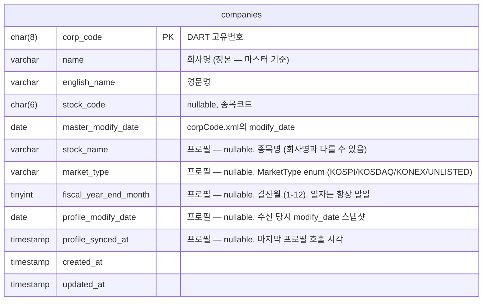

# Company 도메인 스펙 (회사 마스터)

> 참고: https://opendart.fss.or.kr/guide/main.do?apiGrpCd=DS001 의 [공시정보 > 기업개황, 고유번호]

## 스트리밍 파싱

방법:

1. HttpResponse
2. ZipInputStream (압축 풀기, 디스크를 거치지 않음) -> `lazy 스트리밍 디컴프레서`
    1. read() 호출한 만큼 풀어줌
    2.
3. XMLStreamReader (StAX) (하나의 <list> 단위로 읽고 버림)
4. 배치 버퍼 (예: 1000건);
5. upsert
6. 버퍼 비우기

```
  [3MB zip 바이트] → ZipInputStream → 내부 작은 버퍼(수 KB) → read() 호출자
                                      ↑ 여기만 메모리에 살아있음
```

## 회사 마스터
- URL
  - GET https://opendart.fss.or.kr/api/corpCode.xml
- Request
  - crtfc_key
- Response
  - CORPCODE.zip(3.6MB) -> CORPCODE.xml(29.7MB)
  - modify_date: 갱신하는 목적으로 사용 가능 -> last_synced_at

```xml
<?xml version="1.0" encoding="UTF-8"?>
<result>
    <list>
        <corp_code>00434003</corp_code>
        <corp_name>다코</corp_name>
        <corp_eng_name>Daco corporation</corp_eng_name>
        <stock_code> </stock_code>
        <modify_date>20170630</modify_date>
    </list>
    <list>
        <corp_code>00126380</corp_code>
        <corp_name>삼성전자</corp_name>
        <corp_eng_name>SAMSUNG ELECTRONICS CO,.LTD</corp_eng_name>
        <stock_code>005930</stock_code>
        <modify_date>20251201</modify_date>
    </list>
</result>
```

- `stock_code` 가 있는 경우 상장된 회사

## 회사 프로필

- URL
  - GET /api/company.json?corp_code={8자리}


### 비상장 회사

```json
{
    "status": "000",
    "message": "정상",
    "corp_code": "00434003",
    "corp_name": "(주)다코",
    "corp_name_eng": "Daco corporation",
    "stock_name": "다코",
    "stock_code": "",
    "ceo_nm": "김상규",
    "corp_cls": "E",
    "jurir_no": "1615110021778",
    "bizr_no": "3128134722",
    "adres": "충청남도 천안시 청당동 419-12",
    "hm_url": "없음",
    "ir_url": "",
    "phn_no": "041-565-1800",
    "fax_no": "041-563-6808",
    "induty_code": "25931",
    "est_dt": "19970611",
    "acc_mt": "12"
}
```

### 상장 회사

```json
{
    "status": "000",
    "message": "정상",
    "corp_code": "00126380",
    "corp_name": "삼성전자(주)",
    "corp_name_eng": "SAMSUNG ELECTRONICS CO,.LTD",
    "stock_name": "삼성전자",
    "stock_code": "005930",
    "ceo_nm": "전영현, 노태문",
    "corp_cls": "Y",
    "jurir_no": "1301110006246",
    "bizr_no": "1248100998",
    "adres": "경기도 수원시 영통구  삼성로 129 (매탄동)",
    "hm_url": "www.samsung.com/sec",
    "ir_url": "",
    "phn_no": "02-2255-0114",
    "fax_no": "031-200-7538",
    "induty_code": "264",
    "est_dt": "19690113",
    "acc_mt": "12"
}
```

### 변경 빈도 분류

| 빈도 | DART 필드 | 도메인 필드 | 의미 | 변경 사유 예시 |
|---|---|---|---|---|
| 불변 | corp_code | corpCode | DART 고유번호 (8자리) | 발급 후 변경 없음 |
| 불변 | jurir_no | corporateRegistrationNumber | 법인등록번호 | 청산 전엔 불변 |
| 불변 | bizr_no | businessRegistrationNumber | 사업자등록번호 | 거의 불변 |
| 불변 | est_dt | establishedDate | 설립일 (YYYYMMDD) | 사실상 불변 |
| 저빈도 | corp_name | name | 회사명 (법인명) | 사명 변경 (수년 단위) |
| 저빈도 | corp_name_eng | englishName | 영문명 | 사명 변경 |
| 저빈도 | stock_name | stockName | 종목명 (법인명과 다를 수 있음) | 사명/종목명 변경 |
| 저빈도 | stock_code | stockCode | 종목코드 (6자리) | 상장/폐지/이전상장 |
| 저빈도 | corp_cls | marketType | 시장 구분 → `MarketType` (KOSPI/KOSDAQ/KONEX/UNLISTED) | 시장 이전 |
| 저빈도 | induty_code | industryCode | 업종 코드 | 주력 사업 변경 |
| 저빈도 | acc_mt | fiscalYearEndMonth | 결산월 (MM) | 결산기 변경 (드묾) |
| 고빈도 | ceo_nm | ceoName | 대표자명 | 임기 만료 (3~5년) |
| 고빈도 | adres | address | 본사 주소 | 본사 이전 |
| 고빈도 | hm_url | homepageUrl | 홈페이지 URL | 리뉴얼 |
| 고빈도 | ir_url | irUrl | IR 페이지 URL | 리뉴얼 |
| 고빈도 | phn_no | phoneNumber | 전화번호 | 변경 |
| 고빈도 | fax_no | faxNumber | 팩스번호 | 변경 |

#### 정규화 규칙

- ⚠️ **필드명 불일치 (DART 측)**: 영문회사명
  - `corpCode.xml`은 `corp_eng_name`
  - `company.json`은 `corp_name_eng`
  - 값은 동일. 도메인에선 `englishName` 하나로 통합.
- 위 분류표는 `company.json` 기준 필드명.`stock_code` → `null` 통일
    - corpCode.xml에선 `" "`(공백 1개)
  - company.json에선 `""`(빈 문자열)
- `corp_cls` → `MarketType` enum 변환 (어댑터에서 일괄 변환, DB엔 내부 enum 이름 저장)

  | DART 코드 | 내부 enum |
  |---|---|
  | `Y` | `KOSPI` |
  | `K` | `KOSDAQ` |
  | `N` | `KONEX` |
  | `E` | `UNLISTED` |
- `corp_name` → 정본 결정 필요
  - corpCode.xml은 `삼성전자`
  - company.json은 `삼성전자(주)`
- 날짜 필드(`est_dt`, `modify_date`): `YYYYMMDD` String → `LocalDate`
- `acc_mt`: `MM` String → `Month` enum. 한국 회계연도는 월 단위로만 정의되고 일자는 항상 해당 월의 **말일** (도메인 상수). 일자가 필요하면 `YearMonth.atEndOfMonth()` 로 계산.


## 적재전략

- DART API 한도 :  4만건/일
- 마스터(corpCode.xml)
  - 전체 적재
  - 일 단위 동기화 (새벽 1시?)
- 프로필(company.json)
  - 상장사 즉시 적재 (식별 기준: `corp_cls`)
  - 비상장 lazy
  - lazy 트리거: 사용자 조회 + 관련 공시 발생 시 (비동기)
  - modify_date 변경 트리거 (시간 기반 만료 없음)


## ERD

단일 `companies` 테이블 — 마스터 + 프로필을 하나로 합침. 프로필 미적재 행은 프로필 컬럼이 NULL.



위 ERD에서 "프로필 —" 접두사가 붙은 컬럼은 `company.json` 출처. 나머지는 `corpCode.xml` 출처. DDL상 모두 동일 테이블.

### Stale 판정

```sql
WHERE profile_synced_at IS NOT NULL          -- 프로필 받은 회사만 대상
  AND master_modify_date > profile_modify_date   -- 마스터가 더 새로움 → stale
```

시간 기반 만료 정책 없음 (DART의 `modify_date`가 기업개황 전체 변경을 반영).

### "프로필 받았나?" 판정

`profile_synced_at IS NOT NULL` 이 곧 "프로필 적재 완료" 의미.

### 적용한 설계 결정

- **단일 테이블**: 프로필 필드 4개로 축소되어 분리 명분 약함 → 합침. 모든 조회에서 JOIN 없음.
- **회사명 정본**: 마스터(`name`) 사용. 프로필 측 `corp_name`(`(주)` 포함형)은 보관 안 함.
- **`stock_code` 단일 출처**: 마스터에서만 채움. 프로필 응답의 같은 값은 무시.
- **`market_type`**: 프로필 컬럼 (corpCode.xml에 corp_cls 없음). 프로필 미적재 회사의 상장 여부는 `stock_code` 유무로 1차 추정.
- **인덱스 정책**: 추후 결정.
- **미수집 필드 (YAGNI)**: `phn_no`, `fax_no`, `adres`, `hm_url`, `ir_url`, `ceo_nm`, `jurir_no`, `bizr_no`, `induty_code`, `est_dt`. 필요 발생 시 ALTER + DART 재호출로 추가.

